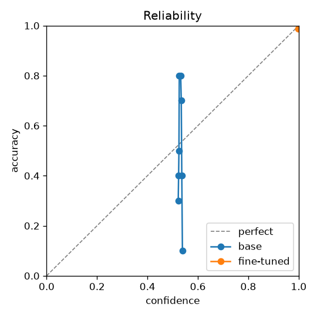

# dmtune report

Majority-class accuracy on this test split: **0.500**

| metric | base | fine-tuned | Δ fine-tuned − base |
|---|---|---|---|
| accuracy | 0.500 | 0.988 | +0.488 ✓ |
| choice_accuracy | 0.500 | 0.975 | +0.475 ✓ |
| noul_accuracy | 0.500 | 1.000 | +0.500 ✓ |
| ece (↓) | 0.084 | 0.014 | -0.071 ✓ |
| brier (↓) | 0.251 | 0.013 | -0.239 ✓ |
| nll (↓) | 0.696 | 0.346 | -0.350 ✓ |
| aurc (↓) | 0.600 | 0.062 | -0.538 ✓ |
| selective_accuracy@50 | 0.500 | 0.975 | +0.475 ✓ |
| selective_accuracy@80 | 0.547 | 0.984 | +0.438 ✓ |
| coverage@5%risk | 0.000 | 1.000 | +1.000 ✓ |
| permutation_flip_rate (↓) | 1.000 | 0.000 | -1.000 ✓ |
| media_reliance | 0.000 | 0.512 | +0.512 ✓ |
| latency_p50_ms (↓) | 243.336 | 239.907 | -3.429 ✓ |
| latency_p95_ms (↓) | 262.400 | 257.644 | -4.756 ✓ |
| peak_memory_gb (↓) | 1.512 | 1.512 | +0.000 |
| is_lime/auprc | 0.755 | 1.000 | +0.245 ✓ |
| is_lime/auroc | 0.718 | 1.000 | +0.282 ✓ |
| kind/balanced_accuracy | 0.500 | 0.975 | +0.475 ✓ |
| kind/macro_f1 | 0.333 | 0.975 | +0.642 ✓ |

## Training

- device: mps, trainable params: 18.15M
- wall time: 547.2s, peak memory: 3.744 GB
- val NLL by epoch: 0.696, 0.616, 0.018, 0.000, 0.000

ECE/Brier/AURC use `answer_confidence` (max calibrated probability). flip rate: choice answers changed by reversing option order. media reliance: answers changed when the image is swapped for flat gray (higher = the model actually looks). 
