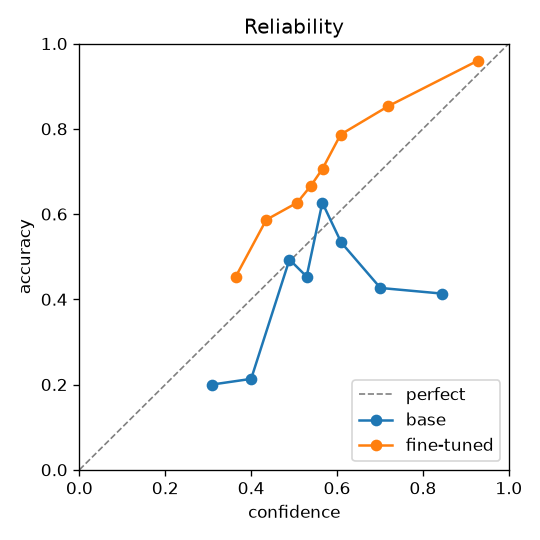

# dmtune report

Majority-class accuracy on this test split: **0.483**

| metric | base | fine-tuned | Δ fine-tuned − base |
|---|---|---|---|
| accuracy | 0.420 | 0.705 | +0.285 ✓ |
| choice_accuracy | 0.313 | 0.670 | +0.357 ✓ |
| noul_accuracy | 0.525 | 0.739 | +0.215 ✓ |
| score_mae (↓) | 0.943 | 0.688 | -0.255 ✓ |
| ece (↓) | 0.152 | 0.122 | -0.031 ✓ |
| brier (↓) | 0.266 | 0.202 | -0.064 ✓ |
| nll (↓) | 1.335 | 0.857 | -0.477 ✓ |
| aurc (↓) | 0.543 | 0.160 | -0.382 ✓ |
| selective_accuracy@50 | 0.500 | 0.827 | +0.327 ✓ |
| selective_accuracy@80 | 0.473 | 0.762 | +0.290 ✓ |
| coverage@5%risk | 0.000 | 0.147 | +0.147 ✓ |
| permutation_flip_rate (↓) | 0.360 | 0.057 | -0.303 ✓ |
| latency_p50_ms (↓) | 445.441 | 444.561 | -0.880 ✓ |
| latency_p95_ms (↓) | 628.805 | 629.167 | +0.363 |
| peak_memory_gb (↓) | 3.264 | 3.264 | +0.000 |
| action/balanced_accuracy | 0.177 | 0.443 | +0.266 ✓ |
| action/macro_f1 | 0.113 | 0.419 | +0.305 ✓ |
| category/balanced_accuracy | 0.596 | 0.888 | +0.293 ✓ |
| category/macro_f1 | 0.515 | 0.903 | +0.388 ✓ |
| churn_risk/qwk | 0.274 | 0.352 | +0.078 ✓ |
| churn_risk/rps (↓) | 0.143 | 0.110 | -0.032 ✓ |
| credential_compromise/auprc | 0.718 | 0.698 | -0.020 |
| credential_compromise/auroc | 0.648 | 0.677 | +0.029 ✓ |
| discrepancy_severity/qwk | 0.000 | -0.045 | -0.045 |
| discrepancy_severity/rps (↓) | 0.255 | 0.268 | +0.012 |
| disposition/balanced_accuracy | 0.250 | 0.267 | +0.017 ✓ |
| disposition/macro_f1 | 0.091 | 0.229 | +0.137 ✓ |
| duplicate/auprc | 0.437 | 0.562 | +0.125 ✓ |
| duplicate/auroc | 0.858 | 0.922 | +0.064 ✓ |
| matches_order/auprc | 0.735 | 0.724 | -0.010 |
| matches_order/auroc | 0.575 | 0.666 | +0.091 ✓ |
| needs_human/auprc | 0.808 | 0.824 | +0.016 ✓ |
| needs_human/auroc | 0.576 | 0.648 | +0.072 ✓ |
| needs_review/auprc | 0.618 | 0.835 | +0.217 ✓ |
| needs_review/auroc | 0.546 | 0.818 | +0.272 ✓ |
| outcome/balanced_accuracy | 0.323 | 0.564 | +0.241 ✓ |
| outcome/macro_f1 | 0.204 | 0.511 | +0.306 ✓ |
| risk/qwk | 0.236 | 0.610 | +0.374 ✓ |
| risk/rps (↓) | 0.197 | 0.095 | -0.102 ✓ |
| severity/qwk | -0.028 | 0.143 | +0.171 ✓ |
| severity/rps (↓) | 0.140 | 0.094 | -0.046 ✓ |
| true_positive/auprc | 0.841 | 0.860 | +0.018 ✓ |
| true_positive/auroc | 0.667 | 0.714 | +0.048 ✓ |
| urgency/qwk | 0.161 | 0.478 | +0.318 ✓ |
| urgency/rps (↓) | 0.228 | 0.129 | -0.099 ✓ |

## Training

- device: mps, trainable params: 33.445M
- wall time: 1884.4s, peak memory: 4.538 GB
- val NLL by epoch: 1.572, 1.011, 0.985

ECE/Brier/AURC use `answer_confidence` (max calibrated probability). flip rate: choice answers changed by reversing option order. media reliance: answers changed when the image is swapped for flat gray (higher = the model actually looks). 
